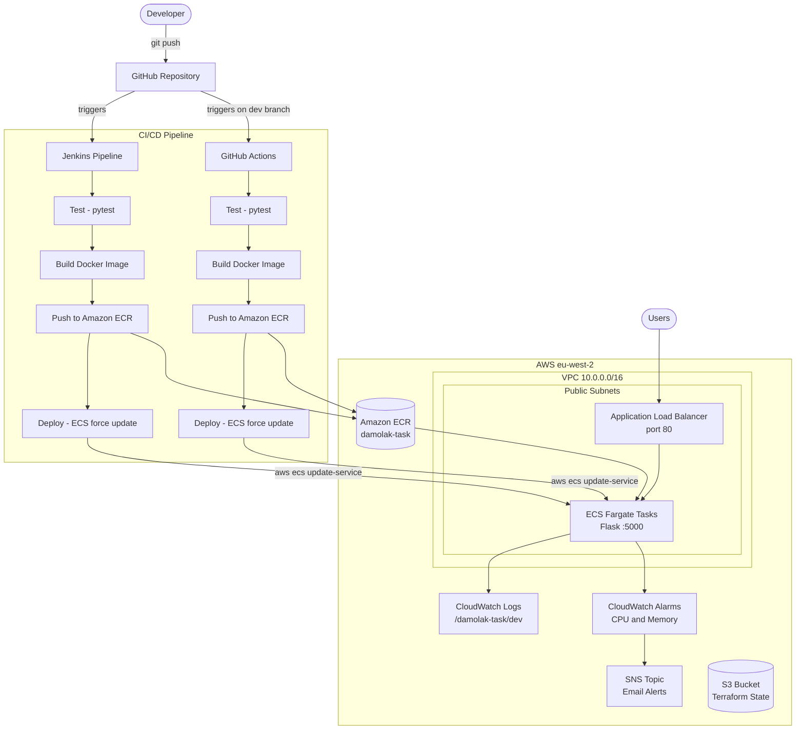

# Damolak Task – Production Application Deployment

## Overview
A containerised Python Flask API deployed to AWS ECS Fargate with a fully automated CI/CD pipeline. Infrastructure is provisioned with modular Terraform, container images are built and pushed to Amazon ECR by Jenkins (with GitHub Actions as a secondary pipeline), and deployments are triggered automatically on every push. CloudWatch provides container logging and metric-based alarms.

---

## Architecture Diagram



---

## Tech Stack

| Layer | Tool |
|-------|------|
| Application | Python Flask |
| Containerisation | Docker |
| Registry | Amazon ECR |
| Orchestration | Amazon ECS Fargate |
| Infrastructure as Code | Terraform (modular) |
| CI/CD | Jenkins (primary) + GitHub Actions (secondary) |
| Monitoring & Logging | AWS CloudWatch Logs + Metric Alarms + SNS |
| State Backend | Amazon S3 with state locking |
| Region | eu-west-2 (London) |

---

## Repository Structure

```
Damolak-task/
├── app/
│   ├── app.py                    # Flask application (/ and /health endpoints)
│   ├── test_app.py               # Unit tests
│   ├── requirements.txt          # Runtime dependencies
│   ├── requirements-test.txt     # Test dependencies (pytest)
│   └── Dockerfile
├── scripts/
│   └── deploy.sh                 # ECS force-deploy script
├── terraform/
│   ├── bootstrap/                # One-time: S3 state bucket + ECR repo
│   ├── modules/
│   │   ├── networking/           # VPC, subnets, IGW, route tables
│   │   ├── ecs/                  # Cluster, task definition, service, ALB, IAM
│   │   └── monitoring/           # CloudWatch alarms + SNS topic
│   ├── dev/                      # Dev environment (eu-west-2, t-shirt small)
│   └── prod/                     # Prod environment (eu-west-2, t-shirt large, 2 tasks)
├── .github/
│   └── workflows/
│       └── deploy.yml            # GitHub Actions pipeline (dev branch)
├── Jenkinsfile                   # Jenkins declarative pipeline (main branch)
└── README.md
```

---

## Prerequisites

- AWS account with IAM credentials (ECR + ECS + EC2 + IAM + CloudWatch permissions)
- Terraform >= 1.0
- Docker
- AWS CLI v2
- Jenkins with plugins: **Pipeline**, **Git**, **Pipeline: AWS Steps**, **Docker Pipeline**, **Credentials Binding**

---

## Deployment Steps

### 1. Bootstrap — create S3 state bucket and ECR repository (once only)
```sh
cd terraform/bootstrap
terraform init
terraform apply
```
Note the `ecr_repository_url` from the output.

### 2. Push the first image to ECR (once only — CI/CD handles all future builds)
```sh
aws ecr get-login-password --region eu-west-2 \
  | docker login --username AWS --password-stdin <ecr_repository_url>

docker build -t <ecr_repository_url>:dev app/
docker push <ecr_repository_url>:dev
```

### 3. Provision dev infrastructure
```sh
cd terraform/dev
terraform init
terraform apply
```
The `app_url` output gives the ALB DNS name.

### 4. Configure Jenkins
1. **Manage Jenkins → Credentials → Global → Add Credentials**
   - Kind: `AWS Credentials` (or `Secret text` x2)
   - ID: `aws-credentials`
2. **New Item → Pipeline**
   - SCM: Git → `https://github.com/OkoyeF/damolak-task.git`
   - Branch: `*/main`
   - Script Path: `Jenkinsfile`

### 5. Configure GitHub Actions
Add two secrets in **GitHub → Settings → Secrets → Actions**:
- `AWS_ACCESS_KEY_ID`
- `AWS_SECRET_ACCESS_KEY`

### 6. Verify the deployment
```sh
curl http://<alb_dns_name>/
# {"message": "Hello from Damolak Task!"}

curl http://<alb_dns_name>/health
# {"status": "healthy"}
```

---

## CI/CD Pipeline

Both pipelines follow the same three stages:

| Stage | What happens |
|-------|-------------|
| **Test** | Installs dependencies, runs `pytest` against the Flask app |
| **Build & Push** | Builds the Docker image, authenticates to ECR, pushes with environment tag |
| **Deploy** | Calls `scripts/deploy.sh` — forces a new ECS deployment and waits for service stability |

**Branch → image tag mapping:**
- Jenkins: `main` → `prod` tag, any other branch → `dev` tag
- GitHub Actions: `dev` branch only → `dev` tag

---

## Monitoring & Logging

**Container Logs:**
- ECS tasks use the `awslogs` Docker log driver
- All stdout/stderr ships to CloudWatch Log Group `/damolak-task/<environment>`
- Retention: 7 days
- View: AWS Console → CloudWatch → Log groups → `/damolak-task/dev`

**Metric Alarms:**
- `dev-ecs-high-cpu` — ECS CPU utilisation > 80% for 4 minutes
- `dev-ecs-high-memory` — ECS memory utilisation > 80% for 4 minutes
- Both alarms publish to an SNS topic; set `alert_email` in the monitoring module to receive email notifications

---

## Design Decisions

| Decision | Rationale |
|----------|-----------|
| ECS Fargate over EKS | Sufficient for this workload; no control plane or node group management overhead |
| Jenkins as primary CI/CD | Required by the brief; GitHub Actions added as secondary |
| Modular Terraform | dev and prod share the same module code with different variable values |
| ALB in front of ECS | Enables zero-downtime rolling deployments with connection draining |
| Public subnets + public IP for Fargate | Avoids NAT gateway cost for a dev/assessment environment |
| S3 backend with locking | Prevents state corruption when multiple runs happen concurrently |
| Static IAM keys for Jenkins | Sufficient for assessment scope; production would use EC2 instance profile or OIDC |
| eu-west-2 (London) | Lower latency from West Africa; GDPR alignment |

---

## Assumptions

- Jenkins runs locally in Docker on the developer's machine
- The ECR repository is created via bootstrap Terraform before the first pipeline run
- HTTP only — TLS termination not configured; production would add an ACM certificate to the ALB

---

## Limitations & Future Improvements

- **No HTTPS** — would add ACM certificate + HTTPS listener to the ALB
- **Static IAM keys** — would replace with EC2 instance profile or OIDC federation
- **No autoscaling** — would add ECS Service Auto Scaling on CPU/request count
- **Single region** — multi-region would require Route 53 latency routing + ECR replication
- **Jenkins not backed up** — production would persist `jenkins_home` to EBS with automated snapshots
- **No GitOps** — would introduce ArgoCD or similar for declarative deployment state
